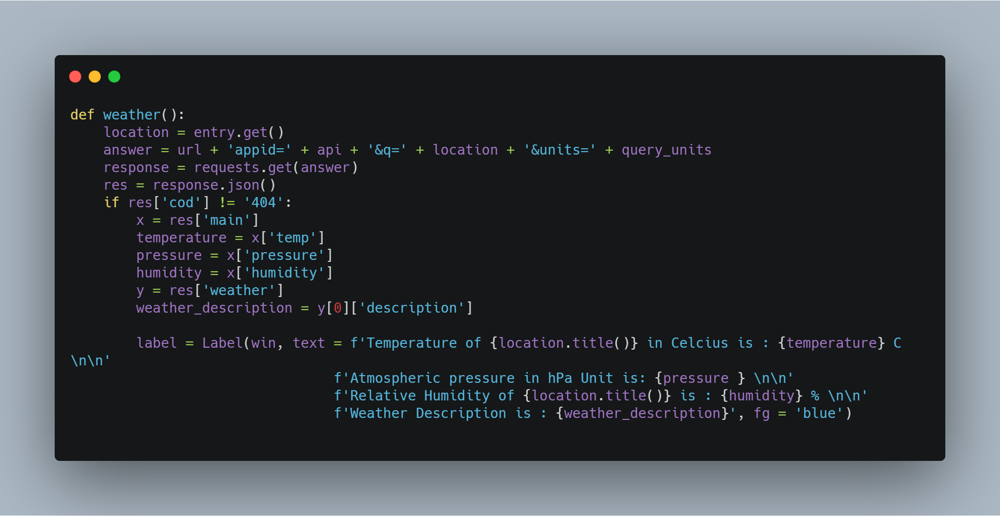

# WeatherApp
A Python tkinter Desktop App to get weather condition of any location around world

#code snippet Image

# File Guide
Readme.md

weatherapp.py file: Python script for the app

# How it works 
Just fill the city name of where you want to check weather condition and click the button and
boom you are done! the program reveals the weather condition, temprature and description 
